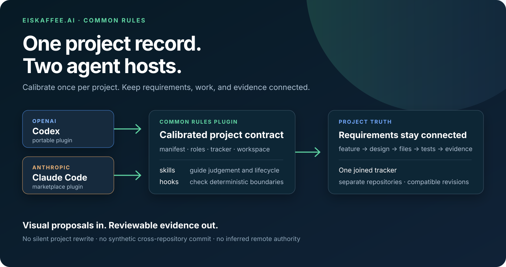
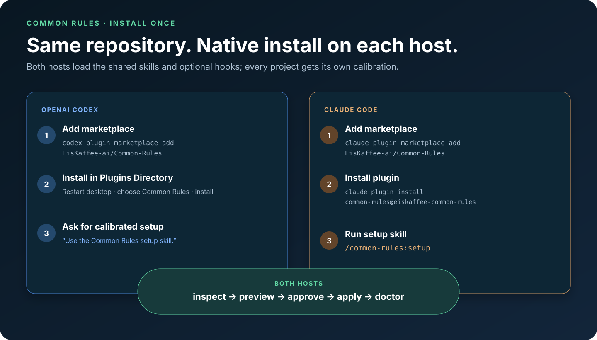
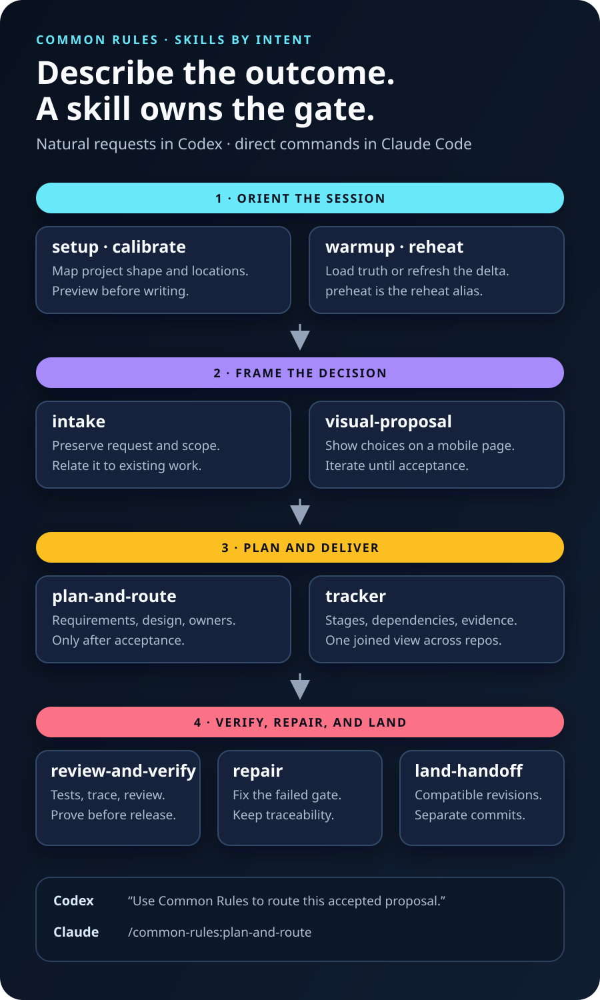
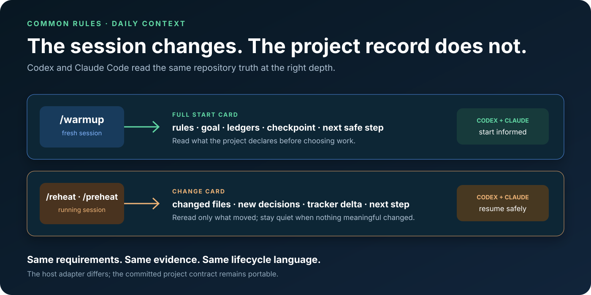
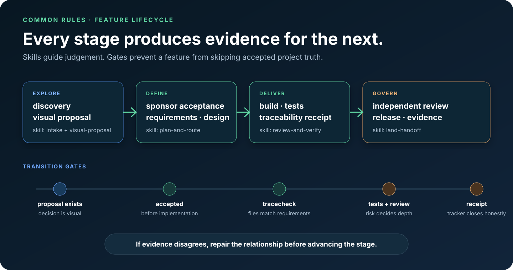
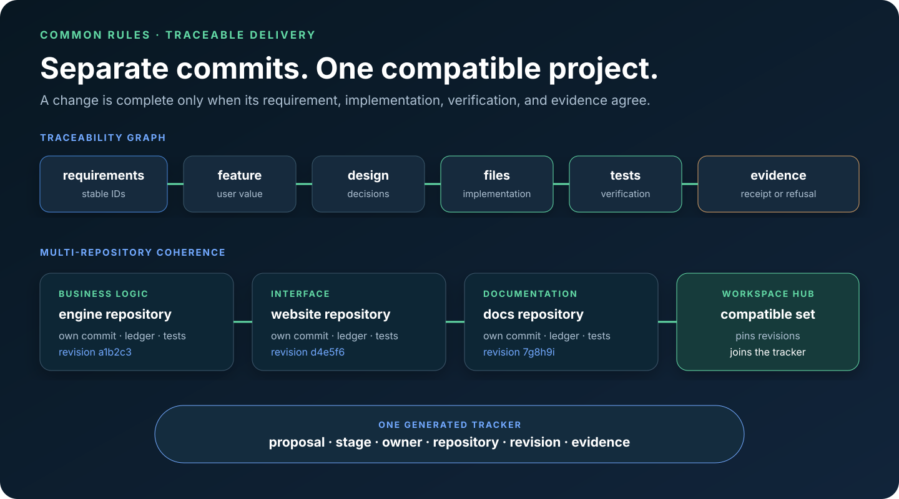

# EisKaffee.ai / Common Rules

### One project record for Codex and Claude Code.

Common Rules is an installable project-tracker plugin for AI-assisted delivery.
It calibrates itself to a new or existing repository, keeps requirements linked
to implementation and tests, and joins compatible work across repositories
without forcing them into one commit.



[**Install the plugin ↓**](#install-the-plugin) · [Explore the tracker](docs/proposals/tracker/index.html) · [Read the user guide](docs/user-guide/) · [Release 1.12.0](docs/RELEASE-1.12.0.md)

## What you get

- **Calibrated setup** — detects an existing or new project, repository roles,
  requirements locations, tracker locations, issue-linking policy, and
  single- or multi-repository topology before writing anything.
- **Visual proposal loop** — turns an idea into a mobile-friendly decision page,
  then carries an executable Luna handoff at the bottom for implementation after
  the sponsor accepts it, with decision and delivery state summarized from their
  authoritative proposal metadata and ledger evidence.
- **Traceability** — connects requirement → feature → design → files → tests →
  evidence, and detects when a linked change needs its documentation updated.
- **One project tracker** — joins separately committed repositories at known,
  compatible revisions instead of inventing a synthetic cross-repository commit.
- **Portable lifecycle skills** — the same setup, intake, planning, verification,
  repair, and handoff language in OpenAI Codex and Claude Code.
- **Deterministic automation** — shipped Python commands assign generated IDs,
  calculate totals and digests, update ledgers, render pages, and verify
  freshness; the AI supplies explicit inputs but never fabricates tracker state.

## Install the plugin



### OpenAI Codex

Add the repository as a marketplace source:

```sh
codex plugin marketplace add EisKaffee-ai/Common-Rules
```

Restart the ChatGPT desktop app, open the **Plugins Directory**, choose the
**EisKaffee.ai Common Rules** marketplace, and install `common-rules`. Then ask:

```text
Use the Common Rules setup skill to calibrate this project.
```

Codex supports repository marketplaces and installs their plugins through the
Plugins Directory. See the official [OpenAI plugin packaging and marketplace guide](https://developers.openai.com/plugins/build/plugins).

### Claude Code

Register the same repository and install the plugin:

```sh
claude plugin marketplace add EisKaffee-ai/Common-Rules
claude plugin install common-rules@eiskaffee-common-rules
```

Start Claude Code in the project and run:

```text
/common-rules:setup
```

Claude Code namespaces plugin skills and installs them from registered
marketplaces. See the official [Claude Code marketplace guide](https://code.claude.com/docs/en/plugin-marketplaces).

> Common Rules previews its project manifest first. It writes only after you
> approve the calibration. Installing the plugin does not automatically trust
> hooks or grant GitHub write access.

## Choose the skill by intent

You do not have to memorize the catalog. In Codex, describe the outcome in
plain language and name Common Rules when you want to be explicit. In Claude
Code, use the namespaced command shown below. The active skill should announce
what it is doing and keep the tracker stage visible.



| When you need to… | Common Rules skill | Example request |
|---|---|---|
| Adopt a new or existing project | `setup` | “Use Common Rules setup. This is an existing app; preview the manifest before writing.” |
| Change repositories, roles, or locations | `calibrate` | “Recalibrate: the engine owns business logic and the website owns the interface.” |
| Turn a request into tracked work | `intake` | “Record this request verbatim, find the related feature, and show the proposed scope.” |
| Explore a decision visually | `visual-proposal` | “Create a visual-first proposal, then prepare its Luna implementation context.” |
| Maintain stages and evidence | `tracker` | “Show every feature that is blocked before implementation and the missing evidence.” |
| Convert an accepted proposal into buildable work | `plan-and-route` | “Route the accepted proposal into numbered requirements, design, tests, and repository owners.” |
| Prove the result is ready | `review-and-verify` | “Verify requirement coverage, tests, traceability, and the compatible revision set.” |
| Fix a failed delivery gate | `repair` | “Tracecheck failed after this code edit; find the narrowest correct repair.” |
| Release independently committed repositories | `land-handoff` | “Prepare the coherent engine, website, and docs revisions for handoff without combining their commits.” |
| Load a fresh session | `warmup` | “Warm up from the project record and tell me the active feature and next gate.” |
| Refresh a running session | `reheat` / `preheat` | “Reheat this session and show only what changed since the last checkpoint.” |
| Support an older adopted project | `standard` *(legacy)* | “Load the shared contract through the legacy entry point, then show the current setup path.” |

In Claude Code, the direct forms are `/common-rules:setup`,
`/common-rules:intake`, `/common-rules:visual-proposal`, and so on. Codex can
select the installed skill from the natural-language requests above. `standard`
remains available for compatibility; new projects should begin with `setup`.

### Example: one repository

```text
1. “Set up Common Rules for this existing application.”             → setup
2. “Track a user-facing export feature.”                             → intake
3. “Show the decision visually; keep iterating until accepted.”       → visual-proposal
4. “Use its Luna context to create requirements and the build plan.”  → plan-and-route
5. “Verify it and prepare the release handoff.”                       → review-and-verify + land-handoff
```

### Example: several repositories

```text
“Calibrate engine as business logic, website as interface, and docs as the
workspace hub. Keep their commits separate. Track one compatible revision set,
and require docs impact evidence when an engine requirement-linked file changes.”
```

Common Rules routes that request through `calibrate`, `tracker`, and
`review-and-verify`. The result is one joined project view, not one artificial
commit.

### Example: deterministic tracker updates

```sh
./bin/new-proposal --project /path/to/project "Export originals"
./bin/tracker ask docs/proposals/NN-export-originals.json \
  --kind feature --quote "Export the selected originals" --state open
./bin/tracker board --project /path/to/project
./bin/tracker board --project /path/to/project --check
```

The scripts choose generated IDs, validate the ledger before writing, render
the tracker from source, and fail when the page is stale. An agent may prepare
the quoted text or command arguments, but it does not type an ID, total,
digest, issue mapping, or generated HTML into the repository. GitHub assigns
issue numbers; Common Rules validates and records the returned identity.

### Example: a traceability failure

```text
“Requirement CR-42 links engine/payment.py and docs/payment.md. I changed the
engine file. Check whether the requirement, tests, and documentation must move.”
```

`tracker` identifies the relationship, `review-and-verify` runs the gate, and
`repair` proposes the smallest missing update or an explicit owner-reviewed
no-change receipt. It never deletes the trace just to make the check pass.

## Context footprint

### Progressive loading, measured

Common Rules is intentionally a skills-first plugin. Codex initially sees each
skill's name, description, and path, then loads the full `SKILL.md` only when
the request selects that workflow. Claude Code follows the same progressive
pattern: descriptions at session start, full skill content when used. Hooks run
outside the model context and cost zero context while idle unless they return
output. See the official [OpenAI skills model](https://developers.openai.com/plugins/concepts/skills)
and [Claude Code context-cost guide](https://code.claude.com/docs/en/features-overview#understand-context-costs).

<!-- context-budget:start -->
| Surface | UTF-8 bytes | Estimated tokens | What actually loads |
|---|---:|---:|---|
| Idle skill discovery (13 names, descriptions, paths) | 2,490 | 623 | Every session/request |
| All `SKILL.md` files combined | 27,595 | 6,899 | Not together; only the selected skill is loaded |
| Optional references | 9,312 | 2,328 | Only when the selected workflow needs one |
| Full skill-package ceiling | 36,907 | 9,227 | Comparison ceiling; never the default load |
| Hook configuration and scripts | — | 0 idle | Execute outside context; returned output is the only cost |
<!-- context-budget:end -->

The largest individual workflow is `warmup` at 13,328 bytes, approximately
3,332 tokens. Its command also reports the project-specific files it reads, so
that recovery cost remains visible rather than being confused with plugin load.
The estimate is deliberately simple and reproducible—UTF-8 bytes divided by
four, rounded up—and is **not process RAM** or model-tokenizer telemetry.

This release shortened discovery descriptions without removing their trigger
conditions: the conservative discovery estimate fell from 849 to 623 tokens,
a 26% reduction. Detailed proposal-to-GitHub synchronization instructions live
in an on-demand tracker reference, so unrelated tracker work does not load
them.

Reproduce the analysis or enforce the 650-token discovery budget:

```sh
./bin/context-budget --compare-ref 7ce6ff2  # Common Rules 1.9.0
./bin/context-budget --json --check
```

### Faster release checks

The full unittest gate uses every available worker without dropping tests.
Large test files split by class even on a cold checkout, then measured shard
durations improve later scheduling. In the 1.10.3 release checkout, the
124-test warmup hotspot fell from the previously documented 575-second floor
to 174.6 seconds (about 70% faster). The final release gate completed all 2,138 tests in 191.2 seconds. Run the same aggregated gate with:

```sh
./bin/quiet --label merge-gate --receipt <receipt.json> --jobs auto -- \
  python3 -m unittest discover -s tests -q
./bin/release-evidence --receipt <receipt.json> --write README.md \
  --write CHANGELOG.md --write docs/RELEASE-1.10.3.md \
  --ledger docs/proposals/37-canonical-project-tracker-and-architecture-issue.json
```

`release-evidence` accepts only a digest-verified receipt for the exact full
merge-gate discovery command. It derives the count and elapsed time from that
receipt and updates both public documentation and the canonical ledger through
shipped Python, not copied or calculated by an agent.

## Calibrate each project

The setup skill inspects the repository before it asks questions. It identifies
what already exists, then asks only for missing choices: business-logic and
interface repositories, requirements and tracker locations, the workspace hub,
and whether issue linking is off, manual, or one-way.

```text
discover → classify → ask only gaps → preview → approve → apply → doctor
```

The committed `.common-rules.json` contains portable project truth. A workspace
hub keeps the compatible repository revisions in
`docs/common-rules/workspace.json`; machine-specific checkout paths stay in the
ignored `.common-rules/workspace.local.json`.

## Work through one visible lifecycle

Start a fresh session with `/warmup`. Use `/reheat` or `/preheat` when a running
session needs the latest repository delta. Common Rules makes the active skill
and lifecycle stage visible instead of requiring you to remember every command.



Every user-deliverable feature moves through:

```text
discovery → visual proposal → acceptance → requirements → design
          → build → test → independent review → release → evidence
```

The proposal and acceptance stages require a valid, readable, sourced decision
artifact—not executable tests. Test obligations start when accepted scope enters
implementation; the proposal records those future checks in its Luna handoff.



## Keep separate repositories correct together

Each repository owns its files, ledger, commits, tests, and release. The
workspace manifest pins a compatible revision set and generates one joined
tracker. If a requirement-linked file changes, `tracecheck` requires the
requirement, ledger evidence, or an owner-reviewed no-change receipt to move
with it.



Useful checks from the Common Rules checkout:

```sh
./bin/project-setup --project /path/to/project doctor
./bin/tracecheck --project /path/to/project
./bin/workspace-tracker --project /path/to/workspace-hub --check
```

## How a project adopts this

New projects should use the setup skill above, review its preview, and apply
only the locations and topology they accept. Previously adopted projects can
still run `/standard` to review the shared contract. For the legacy context-only
path, [`bin/derecord`](bin/derecord) can seed the handoff, tracker, and hooks
without overwriting existing rules.

Existing projects are not silently upgraded. Human review still accepts
proposals, resolves ambiguous project ownership, trusts hooks, approves remote
writes, and decides when a release is ready.

[**Get started →**](docs/GETTING-STARTED.md) · [Capabilities and boundaries](docs/GETTING-STARTED.md#boundaries) · [User guide](docs/user-guide/) · [Release history](CHANGELOG.md)

## Attribution

Common Rules is created and maintained by **Aashish Sud (codeDEXTER)**.

## Licensing

Code is available under [Apache-2.0](LICENSE). Documentation and visual assets
are available under [CC BY 4.0](LICENSE-DOCS).
